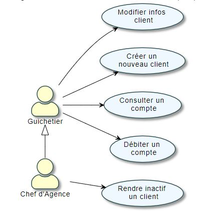

:toc:
:toclevels: 4 
:toc-title: Sommaire
:toc: 

= Cahier des charges V1 
ESCASSUT Sean ; MABILLE Matthis ; TESTA Thomas ; WENDJANEH Hugo

[%hardbreaks]
** Entreprise : <<X,DailyBank>>
** Nom du projet : <<X,DailyBank>>
** Date de dernière modification : <<X,01/04/2022>>

<<<

:sectnums:

---

== Version 1

=== [[bookmark-a]] Présentation du projet et mise en contexte

Le client s’attend à pouvoir régler ses problèmes à tout moment en ligne étant donné le nombre d’informations considérable auquel il a accès. Cela signifie qu’il espère aussi une réactivité plus importante et une disponibilité plus large de la part de sa banque. Au-delà de la réactivité, il a été démontré que les consommateurs sont désormais aussi à la recherche de simplicité, qu’ils sont impatients et que, contrairement à l’époque, ils peuvent être actifs dans la chaîne de valeur.

==== Contexte

Pour s’adapter aux exigences d’instantanéité de leurs clients, les banques françaises ont accentué leurs efforts de restructuration et leurs investissements dans le digital. Des chantiers longs et coûteux. Par exemple, la Banque Postale a indiqué que sa banque mobile baptisée Ma French Bank sera disponible dans les bureaux de Poste au printemps 2019. Mais les banques ne se contentent pas de créer des offres alternatives : elles rénovent aussi en profondeur leurs services de banque au quotidien.

==== Objectifs

L’application doit permettre de gérer des comptes bancaires de dépôt pour des clients préalablement créés. Elle devra permettre de débiter, créditer un compte soit par virement c’est à dire un échange d’argent entre deux comptes distincts mais domiciliés dans le réseau bancaire, soit par une personne physique se présentant devant un guichet.

La version existance (V0) permet au guichetier d'effectuer plusieurs actions, notamment de : 

* Modifier informations client (adresse, téléphone, …)
* Créer un nouveau client
* Consulter un compte
* Débiter un compte (BD)

Dans la version existante (V0), un chef d’agence peut :

* Rendre inactif un client

Diagramme des cas d'utilisation V1 : 

image::UCV1.jpg[]

==== Problématique

La banque DailyBank souhaite développer une application JAVA-Oracle de gestion des comptes clients pour remplacer plusieurs outils obsolètes. Ce développement s’inscrit dans le cadre de la restructuration de ses services bancaires et l’application sera déployée dans les 100 agences que compte son réseau. Vous travaillerez à partir d’une application existante « Daily Bank » qu’il faudra adapter aux nouveaux besoins de la banque.

=== Analyse de l’existant

==== Diagramme des cas d'utilisation V0 : 

=== Analyse des besoins

==== Version 1

Guichetier :

* Créditer/débiter un compte (java et BD avec procédure stockée)
* Créer un compte
* Effectuer un virement de compte à compte
* Clôturer un compte

Chef d’Agence :

* Gérer (faire le « CRUD ») les employés (guichetier et chef d’agence)

=== Analyse des contraintes

==== Contraintes techniques

==== Contraintes organisationnelles

Diagramme de GANTT V1 :

image::GANTTV1.jpg[]