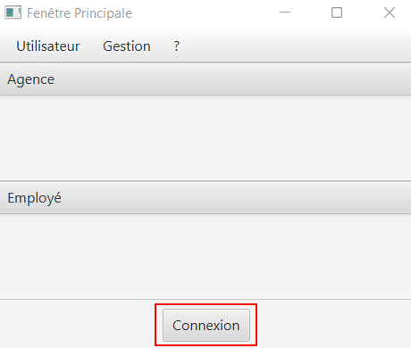
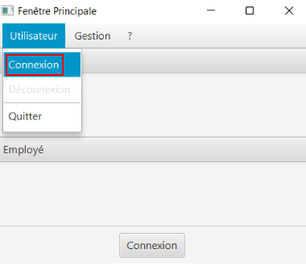
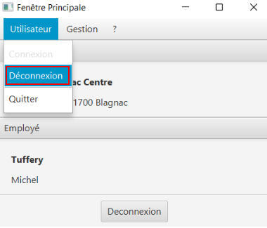
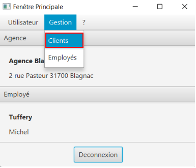

// documentation utilisateur
:toc-title: Sommaire
:toc: macro
:toclevels: 3

= Documentation Utilisateur
Hugo Wendjaneh | Thomas Testa
v1.0, 2018-06-11
toc::[Sommaire]
== Comment ce connecter ?
Pour ce connecter sur l'application il y à deux possiblité. Avec le boutton de connexion.

Ou avec le menu déroulant, Il suffit de cliquer sur "Utilisateur", puis "Connexion".

Un écrant d'identification s'affiche. Vous devrez rentrer par la suite vos identifiant et cliquer sur le boutton "Valider".

image::identification.png[]

== Comment ce déconnecter ?

Pour ce déconnecter il suffit de ce rendre sur les fenêtre principal, puis reproduire les même actions que la connexion. Mais en cliquant sur le boutton "Déconnexion".

image::deconnexion1.png[]

== Comment accéder au gestionnaire des clients ?

Pour accéder au gestionnaire des clients il faut tout d'abord ce connecter. Une fois connecté. Par la suite, sur la fenêtre principale cliquer sur le menu déroulant "Gestion", puis cliquer sur "Clients".

== Comment ajouter un client?

Tout d'abord commencer par aller au gestionnaire des clients

image::gestionnaireClient.png[]

Appuyer sur le bouton "Nouveau client"

Puis rentrer les informations du client dans la fenêtre qui s'est ouverte

image::clientAjouter.png[]

Pour finir il ne vous reste plus qu'à appuyer sur le bouton "Ajouter"

image::resultatClientAjouter.png[]

== Comment rechercher un client?

Tout d'abord commencer par aller au gestionnaire des clients (après avoir ajouter des clients si il n'y a aucun clients)

image::gestionnaireClientChercher.png[]

