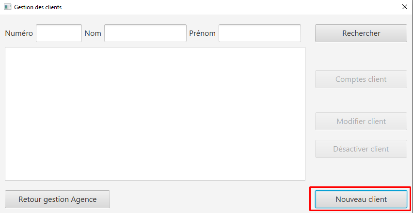
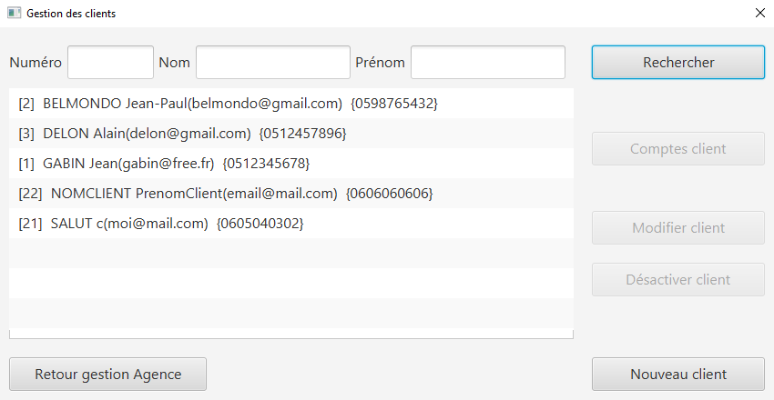
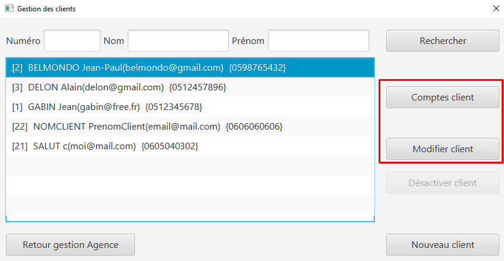
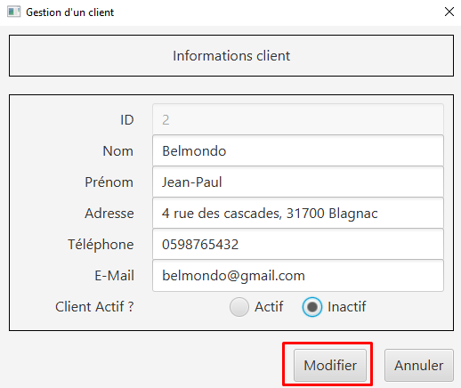
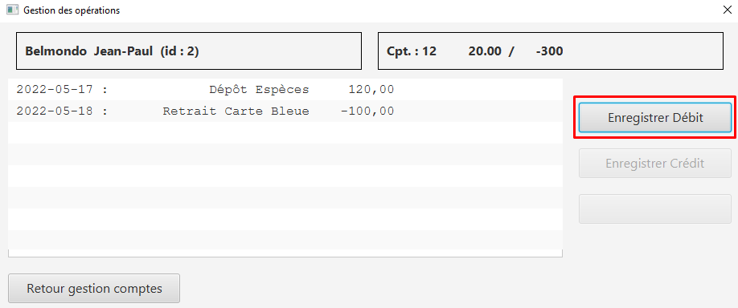
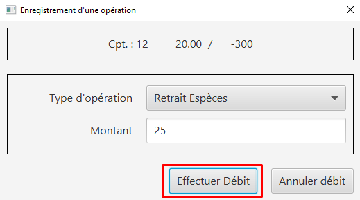

// documentation utilisateur
:toc-title: Sommaire
:toc: macro
:toclevels: 3

= Documentation Utilisateur V0

****
Nom du Projet : **Daily Bank** +
Date : **28/04/2022** +
Equipe : **ESCASSUT Sean - MABILLE Matthis - TESTA Thomas - WENDJANEH Hugo**
****

toc::[Sommaire]

== Introduction
DailyBank à besoin d'une application bancaire pour s'intégrer dans une stratégie de différenciation entre les autres banque et pour répondre aux nouveau besoin clients. Cette application de gestion d'agence bancaire à était restructuré pour permettre de gérer les comptes bancaires de dépôt pour des clients au sein de l'entreprise. Elle permet de débiter, créditer un compte soit par virement c’est à dire un échange d’argent entre deux comptes distincts. Le chef d'agence, via cette application, peut aussi rendre inactif un client.

== Comment se connecter ?
Pour se connecter sur l'application nous avons deux possiblités. Avec le bouton de connexion :

image::images/connexion1.png[]

Avec avec le menu déroulant, il suffit de cliquer sur "Utilisateur", puis "Connexion" :

image::images/connexion2.png[]

Un écran d'identification s'affiche. Vous devrez rentrer par la suite vos identifiants et cliquer sur le bouton "Valider" :

image::images/identification.png[]

== Comment se déconnecter ?

Pour se déconnecter, il faut se rendre sur la fenêtre principale, et cliquer sur le bouton "Déconnexion".

image::images/deconnexion1.png[]

image::images/deconnexion2.png[]

== Comment accéder au gestionnaire des clients ?

Pour accéder au gestionnaire de clients il faut tout d'abord se connecter. Une fois connecté, cliquer sur le menu déroulant "Gestion", puis et se rendre sur "Clients".

== Comment quitter l'application ?

Il existe trois façon de quitter l'application dont une [red]*FORTEMENT DECONSEILLEE*.
Pour fermer l'application il faut que toute les fenêtres soivent fermées, sauf la fenêtre principal.

Par la suite il vous faut vous déconnecter.

Première façon: Cliquer sur la croix en au a gauche de la fenêtre principal.

Un message de confirmation va s'afficher. Cliquer ensuite sur "Ok" pour fermer l'application.

La deuxième façon est d'utiliser le menu déroulant.
Cliquer sur "Utilisateur" puis "Quitter".

image::images/quitter3.png[]

Un message de confirmation va s'afficher. Cliquer ensuite sur "Ok" pour fermer l'application.

WARNING: [red]*Cette solution est fortement déconseillée.*

Vous pouvez appuyer sur ALT+F4 pour fermer l'application.
Une confirmation est quand même demandée.

== Comment ajouter un client ?

_Tout d'abord commencer par aller au gestionnaire des clients._

Appuyer sur le bouton "Nouveau client"

Puis rentrer les informations du client dans la fenêtre qui s'est ouverte

image::images/clientAjouter.PNG[]

Pour finir il ne vous reste plus qu'à appuyer sur le bouton "Ajouter"

== Comment rechercher un client ?

_Tout d'abord commencer par aller au gestionnaire des clients (après avoir ajouter des clients si il n'y a aucun clients)._

La barre de recherche se trouve en haut de la page :

Vous pouvez rechercher un client en fonction de son numéro d'identifaint (Numéro), de son nom (Nom) ou de son prénom (Prénom).

Vous pouvez chercher en entrant les 3 informations complet, ou en ne remplissant que certaines cases et non toute.

A noter, si vous décider ne pas remplir toutes les cases, il est possible que vous tombiez sur plusieurs clients. De ce fait si vous voulez chercher la famille d'un client alors il est facile de retrouver en ne remplissant que son nom (à la condition qu'ils ont tous le même nom et qu'il n'ya pas d'autres clients avec le même nom).

== Comment modifier les informations personelles d'un client?

_Tout d'abord commencer par aller au gestionnaire des clients (après avoir ajouter des clients si il n'y a aucun clients)._

Cliquer sur un client et vous aurez accès aux différentes options à droite.

Appuyer sur le bouton "Modifier client".

Il ne vous plus qu'à modifier les informations personelles du client. Quand vous avez fini, appuyer sur le bouton "Modifier" pour enregistrer les modifications.

A noter, vous ne pouvez pas modifier le numéro d'indentité du client ("ID").

== Comment accéder aux comptes d'un client?

_Tout d'abord commencer par aller au gestionnaire des clients (après avoir ajouter des clients si il n'y a aucun clients)._

Cliquer sur un client et vous aurez accès aux différentes options à droite.

Il ne vous reste plus qu'à appuyer sur le bouton "Comptes client".

image::images/compteClient.PNG[]

== Comment voir les opérations du compte d'un client?

_Tout d'abord commencer par aller au gestionnaire des comptes d'un client._

image::images/compteClient.PNG[]

Cliquer sur un des comptes affichés, vous aurez accès aux options à droite.

image::images/compteDuClient.PNG[]

Cliquer sur "Voir opérations".

== Comment enregistrer un débit manuellement?

_Tout d'abord commencer par aller au gestionnaire des opérations d'un compte client._

Cliquer sur le bouton "Enregistrer Débit".

Entrer le montant du retrait. Quand vous avez fini, appuyer sur le bouton "Effectuer Débit".

A noter, si cela ne fonctionne pas, alors vérifier si il est possible de retirer le montant que vous avez écrit.