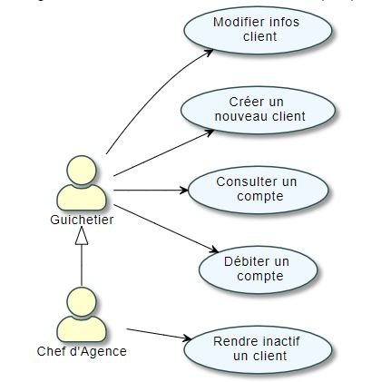
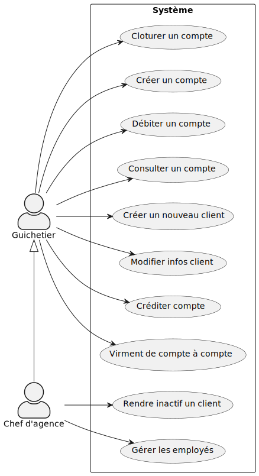

:toc: macro
:toclevels: 3
:toc-title: Sommaire

= Cahier des charges V1

toc::[]

****
Nom du Projet : **Daily Bank** +
Date : **02/04/2022** +
Equipe : **ESCASSUT Sean - MABILLE Matthis - TESTA Thomas - WENDJANEH Hugo**
****

:sectnums:

=== [[bookmark-a]] Présentation du projet et mise en contexte

==== Contexte

Le client s’attend à pouvoir régler ses problèmes à tout moment en ligne étant donné le nombre d’informations considérable auquel il a accès. Pour s’adapter aux exigences d’instantanéité de leurs clients, les banques françaises ont accentué leurs efforts de restructuration et leurs investissements dans le digital. Dans une stratégie de différenciation, il est important pour les banques d’innover et d’effectuer une veille informatique constante afin de développer un avantage concurrentiel sur le marché. C'est donc pour répondre au besoin de leurs clients qu'elles rénovent en profondeur leurs services de banque au quotidien afin de proposer des services digitaux efficaces.

==== Objectifs

L’application doit permettre de gérer des comptes bancaires de dépôt pour des clients préalablement créés. Elle devra permettre de débiter, créditer un compte soit par virement c’est à dire un échange d’argent entre deux comptes distincts mais domiciliés dans le réseau bancaire, soit par une personne physique se présentant devant un guichet.

==== Problématique

La banque DailyBank souhaite une application de gestion des comptes clients pour remplacer plusieurs outils obsolètes. Cette demande s’inscrit dans le cadre de la restructuration de ses services bancaires et l’application sera déployée dans les 100 agences que compte son réseau. Le client dispose déjà d'une application existante « Daily Bank » qu'il faudra adapter aux besoins de la banque pour répondre à la question suivante : "Comment booster la digitalisation de l'expérience client ?"

=== Analyse de l’existant

Il existe déjà une première version de l'application. +
Les utilisateurs actuels de l'application sont: +

* Le guichetier : L'employé "de base" de l'application, autorisé à effectuer certaines opérations 
* Le chef d'agence : dispose de toutes les propriétés du guichetier et peut réaliser des opérations supplémentaires

Cette version (V0) permet au guichetier d'effectuer plusieurs actions, notamment de : 

* Modifier informations client (adresse, téléphone, …)
* Créer un nouveau client
* Consulter un compte
* Débiter un compte (BD)

Cette même version permet seulement au chef d’agence de :

* Rendre inactif un client : Figer le compte d'un client, c'est-à-dire ne pas permettre la réalisation d'opérations sur ce compte

==== Diagramme des cas d'utilisation V0 : 

On peut résumer l'analyse de l'existant en un diagramme UC :

Dans ce diagramme, nous voyons que le guichetier peut effectuer plusieurs actions. Le chef d'agence, qui hérite du guichetier, peut effectuer toutes les actions que le guichetier peut effectuer. De plus, comme nous l'avons rappelé ci-dessus, nous pouvons voir que le chef d'agence peut rendre inactif un client.

=== Analyse des besoins

L'accomplissement de ce projet nécessite de réaliser une application Java qui doit permettre de répondre à des besoins. L’application doit permettre de gérer des comptes bancaires. Pour cela, l'application doit disposer des fonctionnalités listées ci-dessous, organisées en fonction du poste de l’utilisateur de l’application au sein de la banque.

* Guichetier :

- Créditer/débiter un compte (java et BD avec procédure stockée)
- Créer un compte
- Effectuer un virement de compte à compte
- Clôturer un compte

* Chef d’Agence :

- Gérer (faire le « CRUD ») les employés (guichetier et chef d’agence)
** Création d'un employé
** Lecture du profil d'un employé
** Modification du profil d'un employé
** Suppression d'un employé

Toutes ces fonctionnalités sont résumés à travers le diagramme des cas d'utilisation V1 : 

Diagramme de GANTT V1 :

image::GANTTV1.jpg[]

Nous avons créer un ordre de priorité aux différentes actions présentes dans ce gantt.

Le guichetier : 
1 - Le guichetier doit pouvoir créer un compte et créer un nouveau client.
2 - Consulter le compte d'un client
2 - Crédit d'un compte
3 - Débit d'un compte
4 - Modifier les informations d'un client
5 - Cloturer le compte d'un client / effectuer un virement de compte à compte

Le chef d'agence : 
1 - Gérer les employés
2 - Rendre inactif un client

=== Analyse des contraintes

==== Contraintes techniques

Pour ce projet, nous devons utiliser divers langages de programmation. L’application déjà existante utilise le langage JAVA pour le développement des fonctionalités et le langage SQL Oracle pour gérer les données de l'application dans une base de données. Il est également nécessaire de gérer l'interface de l'application en Java pour gérer l'affichage des différents éléments et menus.

==== Contraintes Juridiques

Il est nécessaire de respecter durant la mise en place de ce projet les règlementations en matière de protection des données utilisateur. Per exemple le RGPD (Règlement Général sur la Protection des Données).

==== Contraintes organisationnelles

Il est nécessaire d'effectuer chaque rendu en temps et en heure, des dates précises ont donc été définies avec le client. On peut retrouver ces différentes tâche dans le diagramme de GANTT.

* Rendu de la semaine 13 : 

- V1 du Cahier des Charges
- V1 du diagramme de GANTT

* Rendu de la semaine 16 : 

- V1 du Cahier des Tests
- V2 et V3 du cahier des charges
- V2 et V3 du diagramme de GANTT

* Rendu de la semaine 20 : 

- V1 de la documentation utilisateur
- V1 de la documentation technique
- V2 du Cahier des Tests
- V3 du diagramme de GANTT (__mise à jour__)

* Rendu de la semaine 22 : 

- V2 et V3 de la documentation utilisateur
- V2 et V3 de la documentation technique
- V3 du Cahier des Tests
- V3 du diagramme de GANTT (__mise à jour__)
- V1 de l’application

* Rendu de la semaine 23 : 

- V2 et V3 version de l’application
- Chiffrage du projet
- Bilan du projet
- Livraison finale des documents

Concernant l'organisation de l'équipe, nous utilisons discord afin d'assurer la communication du projet, github afin de communiquer tous les documents du projet et visual studio code afin de créer divers documents tel que le cahier des charges ou les différents diagramme de classe avec plantuml.