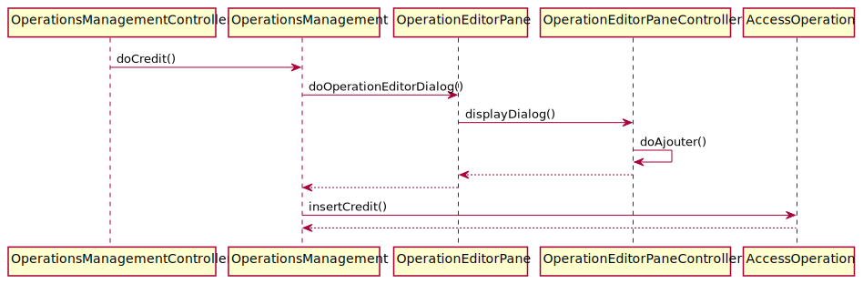
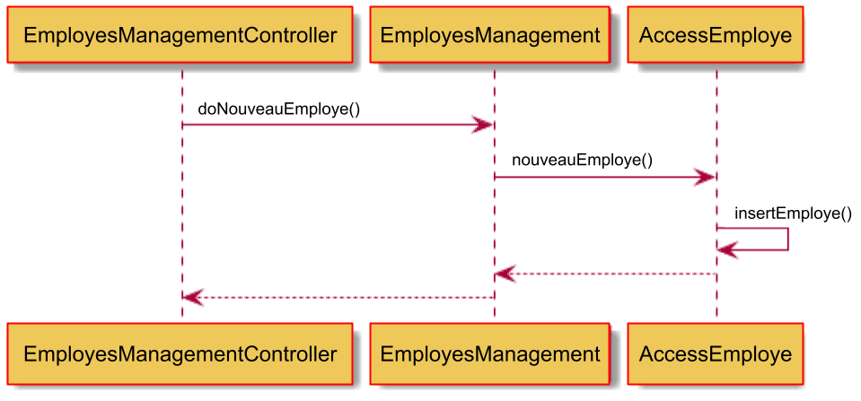
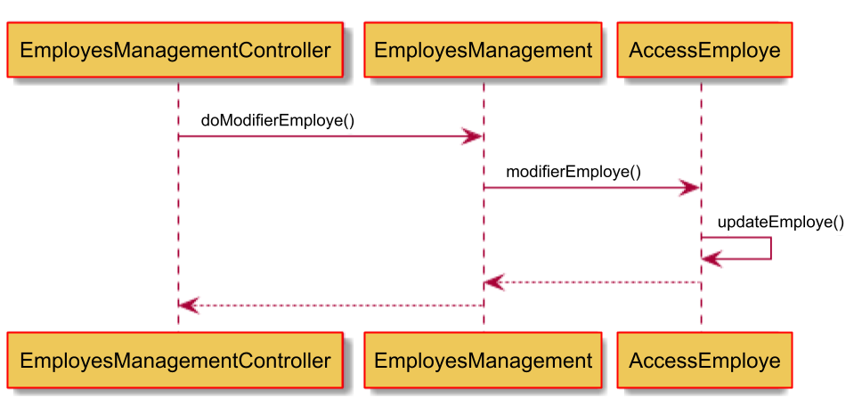

:toc: macro
:toclevels: 3
:toc-title: Sommaire

= Documentation Technique V1

toc::[]

:sectnums:

== Répartition des tâches et état d'avancement
[options="header,footer"]
|=======================
| Version | User | Use Case | Cas d'utilisation | Sean Escassut | Matthis Mabille | Hugo Wendjaneh | Thomas Testa
|1    |Chef d'Agence     |CRUD employé  | Create | | | | F
|1    |Chef d'Agence     |CRUD employé  | Read   | | | | F
|1    |Chef d'Agence     |CRUD employé  | Update | | | | F
|1    |Chef d'Agence     |CRUD employé  | Delete | | | | F
|1    |Guichetier     | Compte | Créer                 |  |F |  | 
|1    |Guichetier     | Compte | Créditer/Débiter      |F |  |  | 
|1    |Guichetier     | Compte | Effectuer un virement |  |  |F | 
|1    |Guichetier     | Compte | Clôturer              |  |F |  | 
|2    |Chef d’Agence     | Compte  | Débit exceptionnel |F |  |  | 
|2    |Chef d’Agence     | Emprunt | Simuler emprunt    |  |D |  | 
|2    |Chef d’Agence     | Emprunt | Simuler assurance  |  |D |  | 
|2    |Guichetier     | Compte | Relevé PDF |  |  |D | 
|2    |Guichetier     | CRUD Prélèvement | Create |NA |NA |NA |NA 
|2    |Guichetier     | CRUD Prélèvement | Read   |NA |NA |NA | NA
|2    |Guichetier     | CRUD Prélèvement | Update |NA |NA |NA | NA
|2    |Guichetier     | CRUD Prélèvement | Delete |NA |NA |NA | NA
|2    |Batch     | Prélèvements automatiques |  |NA |NA |NA | NA
|2    |Batch     | Reléves mensuels          |  |NA |NA |NA | NA

|=======================

F pour Fonctionnel +
D pour en Développement +
NA pour non-assigné

== Présentation de l’application

L’application permet de gérer des comptes bancaires de dépôt pour des clients. Elle permet de débiter, créditer un compte soit par virement c’est à dire un échange d’argent entre deux comptes distincts mais domiciliés dans le réseau bancaire, soit par une personne physique se présentant devant un guichet.

=== Use Case global de l'application 

.Use Case global de l'application
image::plantuml/use-case.svg[]

Dans le diagramme des Use Case ci-dessus, nous pouvons observer qu'il y a deux types d'utilisateurs présents dans l'application, le guichetier et le chef d'agence. +

Le guichetier est l'employé "de base" du système. Il peut réaliser certaines opérations:

* Modifier les informations client (adresse, téléphone, …)
* Créer un nouveau client
* Consulter un compte
* Débiter un compte (BD)
* Créditer un compte
* Cloturer un compte
* Créer un compte
* Effectuer des virements compte à compte

Le chef d'agence est un type d'utilisateur héritant de guichetier, il peut effectuer toutes les opérations de celui-ci en plus de:

* Rendre inactif un client.
* Gérer les employés, ou faire le CRUD (Create Read Update Delete)
** Créer un employé
** Consulter un employé
** Modifier un employé
** Supprimer un employé

=== JavaDoc de l'application

Lien vers la liendelajavadocdegithub.com[javadoc]

=== Diagramme de classe de la base de données

.Diagramme de classe UML de la base de données
image::images/DiagrammeUML.png[]

* Une agence bancaire est composée de plusieurs employés.
* Un employé peut être chef d'agence d'une ou plusieurs agences.
* Un employé peut être un chef d'agence ou un guichetier selon les droits d'accès qu'il possède
* Une agence bancaire est composée de plusieurs clients.
* Un client possède des informations qu'il est possible de modifier.
* Un client peut devenir inactif.
* Un client peut effectuer des opérations sur un compte par l'intermédiaire des employés (débit, crédit, emprunt).
* Un compte contient des informations auxquelles il est possible d'accéder.
* Un client peut avoir plusieurs comptes.
* Un emprunt peut être assuré.

Pour l'instant l'application ne possède que certaines des fonctionnalités du diagramme ci-dessus. 

== Architecture

=== Architecture générale (poste client, serveurs, …) et rôle de chaque élément
.Schéma de l'architecture du fonctionnement de l'application
image::images/schéma-client-serv.png[]
Les postes client exécutent l'application faite en javaFX et se connectent à la base de données oracle, permettant de manipuler les données des clients et des employés. 

=== Ressources externes (.jar, …) utilisées et rôles
L'application utilise la librairie JavaFX pour permettre de disposer d'une interface graphique.

Elle utilise également la librairie externe ojdbc6.jar pour interagir avec la base de données du système des agences bancaires et exécuter des instructions SQL avec Java.

== Installation de l'application

=== En tant qu'utilisateur de l'application
Pré-requis :

* La version 1.8 de https://www.allwebsoft.fr/ihm2022/logiciels/jdk-8u321-windows-x64.exe[Java]
* Les deux fichiers suivants : https://www.allwebsoft.fr/ihm2022/fichiers/setenv-cmd.bat[Fichier 1] et https://drive.google.com/uc?export=download&id=1S2rfpdQ6XPKfU-Gt57UkdALyCFiZM8jq[Fichier 2]
* L'application en .jar : https://github.com/IUT-Blagnac/sae2022-bank-1b03/raw/main/Final/DailyBankApp.jar[lien] +
__Remarque : les deux éléments ci-dessus doivent se trouver dans le même dossier pour plus de simplicité__

Installation de l'application :

* Ouvrir l'application "Powershell"
* Vérifier votre version de Java installée à l'aide de la commande suivante :
_java -version_ +
Remarque : _Si la version installée est Java 1.8.*, vous devriez pouvoir double cliquer sur le .jar que vous venez de télécharger_

* Se déplacer dans le workspace de l'application avec la commandes suivantes :
_cd .\Téléchargements\_ +
Remarque : _Si la version installée est Java 1.8.*, vous pouvez ignorer les trois étapes suivantes._

Sinon :

* Exécuter ensuite la commande suivante : +
_cd setenv-powershell.ps1 ou cd .\setenv-powershell.ps1_
* Tapez ensuite la commande : +
_cmd_
* Et vérifier maintenant votre version de Java : +
_java -version_

Vous pouvez maintenant lancer l'application à l'aide de la commande suivante : +
_java -jar DailyBankApp.jar_

=== En tant qu'administrateur / développeur de l'application

==== Mise à jour de l'application :
Récupération des fichiers de l'application :
__Nous supposons que si vous lisez cette documentation vous avez déjà téléchargé les fichiers de l'application__ +
Dans le cas où vous n'avez pas téléchargé les fichiers, vous pouvez les récupérer en téléchargeant le fichier .zip suivant : +
Lien de téléchargement : https://github.com/IUT-Blagnac/sae2022-bank-1b03/raw/main/Final/DailyBankApp.jar[DailyBankApp.zip]

Dézippez le fichier. +
Importer le projet DailyBankApp.zip dans Eclipse et paramétrez, si ce n'est pas déjà fait, votre IDE avec JAVA FX et Java 1.8. +

Vous pouvez vous aider de la documentation suivante : +
https://drive.google.com/uc?export=download&id=1XbbbfOMqZqDLiM7JNsxBTqlFxd1TE8U_[Lien vers la documentation]

==== Mise à jour de la base de données :

Pour mettre à jour la base de données, vous devez avoir un accès à une base de données Oracle.

Il faut que les identifiants du compte Oracle que vous possédez soit ceux correspondant dans le code Java au niveau de la classe LogToDataBase.java.

Vous pouvez par exemple utiliser le logiciel SQL Developper pour vous connecter à la base de données avec les logins que vous possédez. Ne pas oublier de modifier le nom d'hôte en "oracle.iut-blagnac.fr" et de modifier le SID en "db11g".

=== Structuration en packages de l’application documentée. Principes retenus pour cette structuration
L'application est structurée en plusieurs packages. Le modèle retenu est le modèle est le modèle MVC (modèle, view, controller). De plus on regroupe les packages en deux catégories: +

__Application__ :

* Package tools : Contient contenant les outils de l'application.
* Package view : Contient les classes de l'interface graphique
* Package control : Contient les fonctionnalités de l'application

Cette catégorie contient les données des différentes classes pour pouvoir utiliser les différentes fonctionnalités de l'application. 

__Model__ :

* Package data : Contient les classes de données.
* Package orm : Contient les classes de gestion des données.
* Package orm.exception : Contient les classes d'exceptions.

Il contient des classes de base de données correpondant à certaines tables de la base de données. Il permet également de manipuler les données de la base de données (classe orm).

== Fonctionnalités 

=== Modifier les informations d'un client

Partie "modifier infos client" du diagramme des use case

Partie du diagramme de classes données nécessaires : 

* En lecture : client
* En mise à jour : client

cf. doc. utilisateur "Comment modifier les informations personnelles d’un client ?"

Diagramme de séquence:

.Diagramme de séquence pour la modification d'un client
image::images/DS-Modifier-Client.png[]

=== Créer un nouveau client
Partie "créer un nouveau client" du diagramme des use case

Partie du diagramme de classes données nécessaires : 

* En lecture : Client
* En mise à jour : Client

cf. doc. utilisateur "Comment ajouter un client ?"

Diagramme de séquence :

.Diagramme de séquence pour la création d'un client
image::images/DS-Creer-Client.png[]

=== Consulter un compte
Partie "consulter un compte" du diagramme des UC

Partie du diagramme de classes données nécessaires : 

* En lecture : Client, Compte Courant, Opération, Type Opération

cf. doc. utilisateur "Comment accéder aux comptes d’un client ?"

Diagramme de séquence : 

.Diagramme de séquence pour la consultation d'un compte
image::images/DS-Consulter-Comptes.png[]

=== Débiter un compte
Partie "Débiter un compte" du diagramme des UC

Partie du diagramme de classes données nécessaires : 

* En lecture : Client, Compte Courant, Opération, Type Opération
* En mise à jour : Opération

cf. doc. utilisateur "Comment enregistrer un débit manuellement ?"

Diagramme de séquence :

.Diagramme de séquence pour le débit d'un compte
image::images/DS-Débiter-Compte.png[]

=== Rendre inactif un client
Partie "rendre inactif un client" du diagramme des UC

Partie du diagramme de classes données nécessaires : 

* En lecture : Client
* En mise à jour : Client

cf. doc. utilisateur "Comment modifier les informations personelles d’un client ?"

=== Créditer un compte (Escassut Sean)

Partie "Créditer un compte" du diagramme des UC

Partie du diagramme de classes données nécessaires :

* En lecture : Client, Compte Courant, Opération, Type Opération
* En mise à jour : Opération

cf. doc. utilisateur "Comment enregistrer un crédit manuellement ?"

Diagramme de séquence:

.Diagramme de séquence pour le crédit d'un compte

=== Cloturer un compte (Mabille Matthis)

Partie "cloturer un compte" du diagramme des UC

Partie du diagramme de classes données nécessaires : 

* En lecture : Client, Compte Courant
* En mise à jour : Client, Compte Courant

cf. doc. utilisateur "Comment cloturer un compte client déjà existant ?"

Diagramme de séquence : 

.Diagramme de séquence pour la cloturation d'un compte

=== Créer un compte (Mabille Matthis)

Partie "créer un compte" du diagramme des UC

Partie du diagramme de classes données nécessaires : 

* En lecture : Client, Compte Courant
* En mise à jour : Client, Compte Courant

cf. doc. utilisateur "Comment créer un nouveau compte client ?"

Diagramme de séquence : 

.Diagramme de séquence pour la création d'un compte
image::images/DS-Creer-Comptes.png[]

=== Effectuer des virements compte à compte (Wendjaneh Hugo)

Partie "Virement de compte à compte" du diagramme des UC

Partie du diagramme de classes données nécessaires :

* En lecture : Client, Compte Courant, Opération, Type Opération
* En mise à jour : Opération

cf. doc. utilisateur "Comment effectuer un virement ?"

Diagramme de séquence:

.Diagramme de séquence pour le virement d'un compte à un autre
image::images/DS-Virement.svg[]

=== Gérer les employés, ou faire le CRUD (Testa Thomas):

__En cours de développement__

==== Créer un employé

Partie "créer un nouveau employé" du diagramme des use case

Partie du diagramme de classes données nécessaires : 

* En lecture : Employé
* En mise à jour : Employé

cf. doc. utilisateur "Comment ajouter un employé ?"

Diagramme de séquence :

.Diagramme de séquence pour la création d'un employé

==== Consulter un employé

Partie du diagramme de classes données nécessaires : 

* En lecture : employe
* En mise à jour : employe

==== Modifier un employé

Partie "Comment modifier un employé" du diagramme des use case

Partie du diagramme de classes données nécessaires : 

* En lecture : employe
* En mise à jour : employe

cf. doc. utilisateur "Comment modifier un employé ?"

Diagramme de séquence:

.Diagramme de séquence pour la modification d'un client

==== Supprimer un employé

Partie "Comment supprimer un employé" du diagramme des use case

Partie du diagramme de classes données nécessaires : 

* En lecture : employe
* En mise à jour : employe

cf. doc. utilisateur "Comment supprimer un employé ?"
