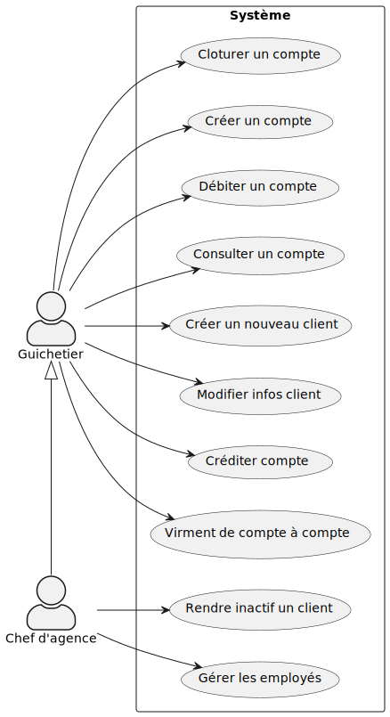
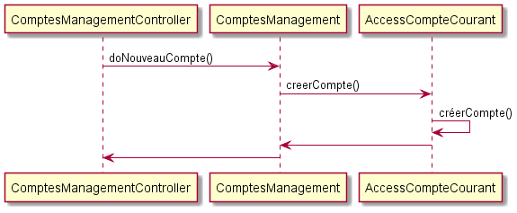
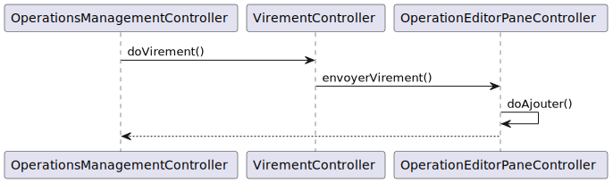

:toc: macro
:toclevels: 3
:toc-title: Sommaire

= Documentation Technique V1

toc::[]

:sectnums:

== Présentation de l’application

=== Use Case global de l'application 

Dans le diagramme des Use Case ci-dessus, nous pouvons observer qu'il y a deux types d'utilisateurs présents dans l'application, le guichetier et le chef d'agence. +

Le guichetier est l'employé "de base" du système. Il peut réaliser certaines opérations:

* Modifier les informations client (adresse, téléphone, …)
* Créer un nouveau client
* Consulter un compte
* Débiter un compte (BD)
* Créditer un compte
* Cloturer un compte
* Créer un compte
* Effectuer des virements compte à compte

Le chef d'agence est un type d'utilisateur héritant de guichetier, il peut effectuer toutes les opérations de celui-ci en plus de:

* rendre inactif un client.
* Gérer les employés, ou faire le CRUD (Create Read Update Delete)
** Créer un employé
** Consulter un employé
** Modifier un employé
** Supprimer un employé

=== Diagramme de classe de la base de données

image::images/DiagrammeUML.png[]

* Une agence bancaire est composée de plusieurs employés.
* Un employé peut être chef d'agence d'une ou plusieurs agences.
* Un employé peut être un chef d'agence ou un guichetier selon les droits d'accès qu'il possède
* Une agence bancaire est composée de plusieurs clients.
* Un client possède des informations qu'il est possible de modifier.
* Un client peut devenir inactif.
* Un client peut effectuer des opérations sur un compte par l'intermédiaire des employés (débit, crédit, emprunt).
* Un compte contient des informations auxquelles il est possible d'accéder.
* Un client peut avoir plusieurs comptes.
* Un emprunt peut être assuré.

Pour l'instant l'application ne possède que certaines des fonctionnalités du diagramme ci-dessus. 

== Architecture

=== Architecture générale (poste client, serveurs, …) et rôle de chaque élément
image::images/schéma-client-serv.png[]
Les postes client exécutent l'application faite en javaFX et se connectent à la base de données oracle, permettant de manipuler les données des clients et des employés. 

=== Ressources externes (.jar, …) utilisées et rôles
L'application utilise la librairie JavaFX pour permettre de disposer d'une interface graphique.

Elle utilise également la librairie externe ojdbc6.jar pour interagir avec la base de données du système des agences bancaires et exécuter des instructions SQL avec Java. 

=== Structuration en packages de l’application documentée. Principes retenus pour cette structuration
L'application est structurée en plusieurs packages. Le modèle retenu est le modèle est le modèle MVC (modèle, view, controller). De plus on regroupe les packages en deux catégories: +

__Application__ :

* Package tools : Contient contenant les outils de l'application.
* Package view : Contient les classes de l'interface graphique
* Package control : Contient les fonctionnalités de l'application

Cette catégorie contient les données des différentes classes pour pouvoir utiliser les différentes fonctionnalités de l'application. 

__Model__ :

* Package data : Contient les classes de données.
* Package orm : Contient les classes de gestion des données.
* Package orm.exception : Contient les classes d'exceptions.

Il contient des classes de base de données correpondant à certaines tables de la base de données. Il permet également de manipuler les données de la base de données (classe orm).

== Fonctionnalités 

=== Modifier les informations d'un client

Partie "modifier infos client" du diagramme des use case

Partie du diagramme de classes données nécessaires : 

* En lecture : client
* En mise à jour : client

cf. doc. utilisateur "Comment modifier les informations personnelles d’un client ?"

Diagramme de séquence:

image::images/DS-Modifier-Client.png[]

=== Créer un nouveau client
Partie "créer un nouveau client" du diagramme des use case

Partie du diagramme de classes données nécessaires : 

* En lecture : Client
* En mise à jour : Client

cf. doc. utilisateur "Comment ajouter un client ?"

Diagramme de séquence :

image::images/DS-Creer-Client.png[]

=== Consulter un compte
Partie "consulter un compte" du diagramme des UC

Partie du diagramme de classes données nécessaires : 

* En lecture : Client, Compte Courant, Opération, Type Opération

cf. doc. utilisateur "Comment accéder aux comptes d’un client ?"

Diagramme de séquence : 

image::images/DS-Consulter-Comptes.png[]

=== Débiter un compte
Partie "Débiter un compte" du diagramme des UC

Partie du diagramme de classes données nécessaires : 

* En lecture : Client, Compte Courant, Opération, Type Opération
* En mise à jour : Opération

cf. doc. utilisateur "Comment enregistrer un débit manuellement ?"

=== Rendre inactif un client
Partie "rendre inactif un client" du diagramme des UC

Partie du diagramme de classes données nécessaires : 

* En lecture : Client
* En mise à jour : Client

cf. doc. utilisateur "Comment modifier les informations personelles d’un client ?"

=== Créditer un compte

__En cours de développement__

Partie "Créditer un compte" du diagramme des UC

Partie du diagramme de classes données nécessaires :

* En lecture : Client, Compte Courant, Opération, Type Opération
* En mise à jour : Opération

Diagramme de séquence:

image::images/DS-Crediter.svg[]

cf. doc. utilisateur "Comment enregistrer un crédit manuellement ?"

=== Cloturer un compte

Partie "cloturer un compte" du diagramme des UC

Partie du diagramme de classes données nécessaires : 

* En lecture : Client, Compte Courant
* En mise à jour : Client, Compte Courant

cf. doc. utilisateur "Comment cloturer un compte client déjà existant ?"

Diagramme de séquence : 

image::images/DS-Cloturer-Compte.png[]

=== Créer un compte

Partie "créer un compte" du diagramme des UC

Partie du diagramme de classes données nécessaires : 

* En lecture : Client, Compte Courant
* En mise à jour : Client, Compte Courant

cf. doc. utilisateur "Comment créer un nouveau compte client ?"

Diagramme de séquence : 

=== Effectuer des virements compte à compte

Partie "Virement de compte à compte" du diagramme des UC

Partie du diagramme de classes données nécessaires :

* En lecture : Client, Compte Courant, Opération, Type Opération
* En mise à jour : Opération

Diagramme de séquence:

cf. doc. utilisateur "Comment effectuer un virement ?"

=== Gérer les employés, ou faire le CRUD (Create Read Update Delete) :

__En cours de développement__

==== Créer un employé
==== Consulter un employé
==== Modifier un employé
==== Supprimer un employé