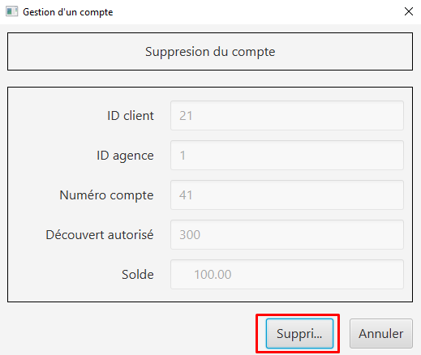

// documentation utilisateur
:toc-title: Sommaire
:toc: macro
:toclevels: 3

= Documentation Utilisateur V1

****
Nom du Projet : **Daily Bank** +
Date : **29/05/2022** +
Equipe : **ESCASSUT Sean - MABILLE Matthis - TESTA Thomas - WENDJANEH Hugo**
****

toc::[Sommaire]

== Contexte du projet
Daily Bank est un réseau français de 100 agences bancaires. Il est nécessaire pour eux de restructurer leur réseau afin de s’intégrer dans une stratégie de différenciation. Ils possèdent plusieurs outils qui deviennent obsolètes et une première version d’application qui nécessite une refonte. Les besoins de la banque ont évolués, tout comme ceux de leurs clients, il faut donc développer plusieurs fonctinnalités pour répondre à ces nouveaux besoins.

== Objectifs du projet
Le but est de partir d’une application existante et d’y rajouter des fonctionnalités. Il y a deux types d’utilisateurs dans l’application : le guichetier et le chef d’agence. Les guichetiers pourront créer de nouveaux clients et faire les opérations courantes (CRUD). Les chefs d’agences pourront gérer les employés et les opérations exeptionnelles.

== Installation de l'application

Pré-requis :

* La version 1.8 de https://www.allwebsoft.fr/ihm2022/logiciels/jdk-8u321-windows-x64.exe[Java]
* Les deux fichiers suivants : https://www.allwebsoft.fr/ihm2022/fichiers/setenv-cmd.bat[Fichier 1] et https://drive.google.com/uc?export=download&id=1S2rfpdQ6XPKfU-Gt57UkdALyCFiZM8jq[Fichier 2]
* L'application en .jar : https://drive.google.com/uc?export=download&id=1QGhUSPPWU4erVOsFe6FiBaxiUISYKFLm[lien] +
__Remarque : les deux éléments ci-dessus doivent se trouver dans le même dossier pour plus de simplicité__

Installation de l'application :

* Ouvrir l'application "Powershell"
* Vérifier votre version de Java installée à l'aide de la commande suivante :
_java -version_ +
Remarque : _Si la version installée est Java 1.8.*, vous devriez pouvoir double cliquer sur le .jar que vous venez de télécharger_

* Se déplacer dans le workspace de l'application avec la commandes suivantes :
_cd .\Téléchargements\_ +
Remarque : _Si la version installée est Java 1.8.*, vous pouvez ignorer les trois étapes suivantes._

Sinon :

* Exécuter ensuite la commande suivante : +
_cd setenv-powershell.ps1 ou cd .\setenv-powershell.ps1_
* Tapez ensuite la commande : +
_cmd_
* Et vérifier maintenant votre version de Java : +
_java -version_

Vous pouvez maintenant lancer l'application à l'aide de la commande suivante : +
_java -jar DailyBankV0.jar_

== Comment se connecter ?
Pour se connecter sur l'application vous avez deux possiblités. Avec le bouton de connexion :

image::images/connexion1.png[]

Avec le menu déroulant, il suffit de cliquer sur "Utilisateur", puis de vous rendre sur "Connexion" :

image::images/connexion2.png[]

Un écran d'identification s'affiche. Vous devrez rentrer par la suite vos identifiants et cliquer sur le bouton "Valider" :

image::images/identification.png[]

== Comment se déconnecter ?

Pour se déconnecter, il faut se rendre sur la fenêtre principale, et cliquer sur le bouton "Déconnexion".

image::images/deconnexion1.png[]

Vous pouvez également vous rendre dans le menu déroulant "Utilisateur" et cliquer sur l'option "Déconnexion".

image::images/deconnexion2.png[]

== Comment accéder au gestionnaire des clients ?

Pour accéder au gestionnaire de clients il faut tout d'abord se connecter. Une fois connecté, cliquez sur le menu déroulant "Gestion", et rendez-vous sur "Clients".

image::images/gestionClients.png[]

== Comment quitter l'application ?

Il existe trois façons de quitter l'application dont une [red]*FORTEMENT DECONSEILLEE*.
Pour fermer l'application, il faut que toutes les fenêtres soient fermées, sauf la fenêtre principal.

Première façon : Cliquez sur la croix en haut à gauche de la fenêtre principale.

image::images/quitter1.png[]

Un message de confirmation va s'afficher. Cliquez ensuite sur "Ok" pour fermer l'application.

image::images/quitter2.png[]

La deuxième façon est d'utiliser le menu déroulant.
Cliquez sur "Utilisateur" puis "Quitter".

image::images/quitter3.png[]

Un message de confirmation va s'afficher. Cliquez ensuite sur "Ok" pour fermer l'application.

WARNING: [red]*Cette solution est fortement déconseillée.*

Vous pouvez appuyer sur ALT+F4 pour fermer l'application.
Un message de confirmation va quand même s'afficher. Cliquez ensuite sur "Ok" pour fermer l'application.

== Comment ajouter un client ?

_Tout d'abord commencer par vous rendre sur la fenêtre gestionnaire des clients._

image::images/gestionnaireClient.PNG[]

Appuyez sur le bouton "Nouveau client"

Puis rentrez les informations du client dans la fenêtre qui vient de s'ouvrir.

image::images/clientAjouter.PNG[]

Pour finir, il ne vous reste plus qu'à appuyer sur le bouton "Ajouter".

image::images/resultatClientAjouter.PNG[]

== Comment rechercher un client ?

_Tout d'abord commencer par vous rendre sur la fenêtre gestionnaire des clients._

image::images/gestionnaireClientChercher.PNG[]

La barre de recherche se trouve en haut de la page :

image::images/barreRecherche.PNG[]

Vous pouvez rechercher un client en fonction de son numéro d'identifiant (Numéro), de son nom (Nom) ou de son prénom (Prénom).

La recherche peut être effectuée en entrant toutes les informations ou en remplissant uniquement certaines cases.

A noter : Si vous décidez ne pas remplir toutes les cases, il est possible que vous tombiez sur plusieurs clients. De ce fait, si vous souhaitez chercher la famille d'un client, il est plus facile de trouver celle-ci en ne remplissant que la case Nom (à la condition qu'ils aient tous le même nom de famille et qu'il n'y ait pas d'autres clients avec le même nom).

== Comment modifier les informations personelles d'un client ?

_Tout d'abord commencer par vous rendre sur la fenêtre gestionnaire des clients._

image::images/gestionnaireClientChercher.PNG[]

Vous pouvez cliquer sur un client afin d'accéder aux différentes options à droite de la fenêtre qui vient de s'ouvrir.

image::images/gestionnaireCompteClient.PNG[]

Appuyez sur le bouton "Modifier client".

image::images/modifierClient.PNG[]

Il ne vous reste plus qu'à modifier les informations personnelles du client. Quand vous avez fini, appuyez sur le bouton "Modifier" pour enregistrer les modifications.

A noter : Vous ne pouvez pas modifier le numéro d'identité du client ("ID").

== Comment accéder aux comptes d'un client ?

_Tout d'abord commencer par vous rendre sur la fenêtre gestionnaire des clients._

image::images/gestionnaireClientChercher.PNG[]

Vous pouvez cliquer sur un client afin d'accéder aux différentes options à droite de la fenêtre qui vient de s'ouvrir.

image::images/gestionnaireCompteClient.PNG[]

Il ne vous reste plus qu'à appuyer sur le bouton "Comptes client".

image::images/CompteClient.PNG[]

== Comment voir les opérations du compte d'un client ?

_Tout d'abord commencer par vous rendre sur la fenêtre gestionnaire des clients._

image::images/CompteClient.PNG[]

Vous pouvez cliquer sur un le compte d'un client afin d'accéder aux différentes options à droite de la fenêtre qui vient de s'ouvrir.

image::images/compteDuClient.PNG[]

Cliquez ensuite sur "Voir opérations".

image::images/OpérationCompteVisualisation.PNG[]

== Comment enregistrer un débit manuellement ?

_Tout d'abord commencer par vous rendre sur la fenêtre gestionnaire des clients._

image::images/operationsCompte.PNG[]

Cliquez sur le bouton "Enregistrer Débit".

image::images/operationDebit.PNG[]

Entrez le montant du retrait. Quand vous avez fini, appuyez sur le bouton "Effectuer Débit".

A noter : Si cela ne fonctionne pas, alors vérifiez qu'il soit possible de retirer le montant que vous souhaitez.

== Comment créer un nouveau compte client ?

_Pour réaliser cette manoeuvre, il est nécessaire de s'être connecté auparavant_

Commencez par vous rendre sur la fenêtre gestionnaire des clients.

Cliquez ensuite sur le bouton "Rechercher" afin d'afficher la liste des clients.

Sélectionnez ensuite un compte et cliquez sur le bouton "Comptes client"

image::images/CompteClientModifié.png[]

Une nouvelle page s'affiche référençant les différents comptes du client. +
Vous pouvez cliquez sur le bouton "Nouveau compte" afin de créer un nouveau compte en entrant le solde du compte initial (*_supérieur à 50 !_*) et le découvert autorisé.

Quand vous avez fini, appuyez sur le bouton "Ajouter".

image::images/CompteClientModifié.png[]

Un nouveau compte a été créé !

== Comment cloturer un compte client déjà existant ?

_Pour réaliser cette manoeuvre, il est nécessaire de s'être connecté auparavant_

Commencez par vous rendre sur la fenêtre gestionnaire des clients.

Cliquez ensuite sur le bouton "Rechercher" afin d'afficher la liste des clients.

Sélectionnez ensuite un compte et cliquez sur le bouton "Comptes client".

Une nouvelle page s'affiche référençant les différents comptes du client. +
Cliquez sur le compte que vous souhaitez cloturer et appuyez sur "Supprimer Compte". 

Appuyez ensuite sur le bouton de validation "Supprimer".

image::images/CompteSupprimé.png[]

Le compte est maintenant cloturé ! Il n'est plus possible de le modifier, ni de voir les opérations de celui-ci.